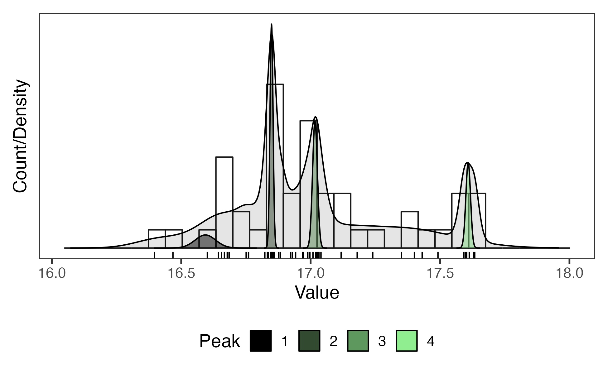

***Figure:*** *Demonstration of peak finding for a sample dataset from Trayler et al. ([2020](https://pubs.geoscienceworld.org/gsa/gsabulletin/article/132/1-2/233/570826/An-improved-approach-to-age-modeling-in-deep-time?casa_token=FGSsojPXafwAAAAA%3aHwyxNEkzCmIkKK-IZ-ZsZxHaN9aKG78eQxBNSiJvCvve9TbXZLkw6quwXF8T2h4Ldxp45jI)). Any 1D array of data with accompanying uncertainties (49 age estimates with standard errors in this case; boxplot) can be represented as a sum of discrete normal distributions (light grey probability distribution function). Clusters of similar data (age estimates in this case) can be found by implementing a Gaussian Mixture Model (a type of unsupervised classification algorithm; grey to green peaks) that fits k = n discrete normal distributions to the data by maximizing the log likelihood of the data (e.g., Banfield & Raftery, [1993](https://www.jstor.org/stable/2532201?casa_token=KkfdXmTuw14AAAAA%3A-YxwRAH3gVUUtXa6ScpyNNGkgzHWZoY926LZHc4_2Qr-S1j3NuGez7hO5ABHNs1dlwek617wtKJurul8bZJnJCFrjsNPMP_oFRRurlZ8-2lMElPoxCWt)).*

# Peakfit Explorer (2021)

This shiny application implements Gaussian Mixture Modeling, a type of unsupervised classification algorithm (e.g., Banfield & Raftery, [1993](https://www.jstor.org/stable/2532201?casa_token=KkfdXmTuw14AAAAA%3A-YxwRAH3gVUUtXa6ScpyNNGkgzHWZoY926LZHc4_2Qr-S1j3NuGez7hO5ABHNs1dlwek617wtKJurul8bZJnJCFrjsNPMP_oFRRurlZ8-2lMElPoxCWt)), to find peak positions of 1D datasets using the `peakfit` function from the [IsoplotR](https://github.com/pvermees/IsoplotR/) package (Vermeesch, [2018](https://www.sciencedirect.com/science/article/pii/S1674987118300835?via%3Dihub)).


## Repository

This repository provides all materials for running the application *Peakfit Explorer* (Kerswell, [2023](https://doi.org/10.17605/OSF.IO/2BU3C)).

This repository includes:

- A shiny application
- A example dataset
- A Makefile to compile and run the shiny application

This repository is self-contained but requires the following software (all open-source).

## Prerequisite software

### R

This application is written in R. Follow the instructions at [R's homepage](https://www.r-project.org) to download and install the latest release of R on your machine.

## Running the application

```
# Clone this repository
git clone https://github.com/buchanankerswell/pkft.git

# Change into the directory
cd pkft

# Use Makefile to compile and run
make
```

This will check for required R packages and try to install missing packages automatically.

If all packages are found and available it will proceed to run the application locally on your machine. Just navigate to the url indicated in the terminal after launching the app (`listening on [url] ...`).

## Shinyapps.io

Alternatively, you can run a precompiled version of the application on Shinyapps.io from [here](https://kerswell.shinyapps.io/peak/).

## Acknowledgement

I gratefully acknowledge feedback and suggestions provided by [Matthew Kohn](https://scholar.google.com/citations?user=xSyB1KQAAAAJ&hl=en&oi=ao) and [Kayleigh Harvey](https://www.linkedin.com/in/kayleigh-harvey-phd-98471956). You can cite the app using the following:


```
Kerswell, B. (2023, [month, day]). Peakfit Explorer. https://doi.org/10.17605/OSF.IO/2BU3C
```

## Open Research

All data, code, and relevant information for this work can be found at [https://github.com/buchanankerswell/pkft](https://github.com/buchanankerswell/pkft), and at [https://doi.org/10.17605/OSF.IO/2BU3C](https://doi.org/10.17605/OSF.IO/2BU3C), the official Open Science Framework data repository ([Kerswell, 2023](https://doi.org/10.17605/OSF.IO/2BU3C)). All code is MIT Licensed and free for use and distribution (see license details).

# License

MIT License

Copyright (c) 2021 Buchanan Kerswell

Permission is hereby granted, free of charge, to any person obtaining a copy
of this software and associated documentation files (the "Software"), to deal
in the Software without restriction, including without limitation the rights
to use, copy, modify, merge, publish, distribute, sublicense, and/or sell
copies of the Software, and to permit persons to whom the Software is
furnished to do so, subject to the following conditions:

The above copyright notice and this permission notice shall be included in all
copies or substantial portions of the Software.

THE SOFTWARE IS PROVIDED "AS IS", WITHOUT WARRANTY OF ANY KIND, EXPRESS OR
IMPLIED, INCLUDING BUT NOT LIMITED TO THE WARRANTIES OF MERCHANTABILITY,
FITNESS FOR A PARTICULAR PURPOSE AND NONINFRINGEMENT. IN NO EVENT SHALL THE
AUTHORS OR COPYRIGHT HOLDERS BE LIABLE FOR ANY CLAIM, DAMAGES OR OTHER
LIABILITY, WHETHER IN AN ACTION OF CONTRACT, TORT OR OTHERWISE, ARISING FROM,
OUT OF OR IN CONNECTION WITH THE SOFTWARE OR THE USE OR OTHER DEALINGS IN THE
SOFTWARE.